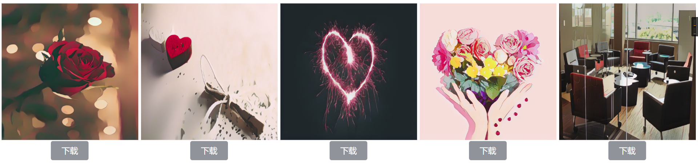

# cartoon-media

> image or video to cartoon



> base repo [cartoonize](https://github.com/experience-ml/cartoonize)

###  get starter with docker 

> build image

```sh
docker build -t cartoon-media:1.0 .
```

> start container

```sh
docker run -d --name cartoon-1.0 -p 18080:18080 cartoon-media:1.0
```

> visit: http://localhost:18080/front/

###  get start with local

```cmd
cd server
pip uninstall -y protobuf
pip install protobuf==3.19.0 -i https://pypi.douban.com/simple      
pip install -r requirements.txt -i https://pypi.douban.com/simple 
uvicorn main:app --reload --port 18080 --host 0.0.0.0

```
> visit: http://localhost:18080/front/


## 中文

### 容器构建和启动


> 下载源码构建容器

```sh
docker build -t cartoon-media:1.0 .
```

> 启动容器

```sh
docker run -d --name cartoon-1.0 -p 18080:18080 cartoon-media:1.0
```

> 启动后访问: http://localhost:18080/front/

###  本地启动

> 注意依赖安装

```cmd
cd server
pip uninstall -y protobuf
pip install protobuf==3.19.0 -i https://pypi.douban.com/simple      
pip install -r requirements.txt -i https://pypi.douban.com/simple 
uvicorn main:app --reload --port 18080 --host 0.0.0.0

```
> 访问: http://localhost:18080/front/
